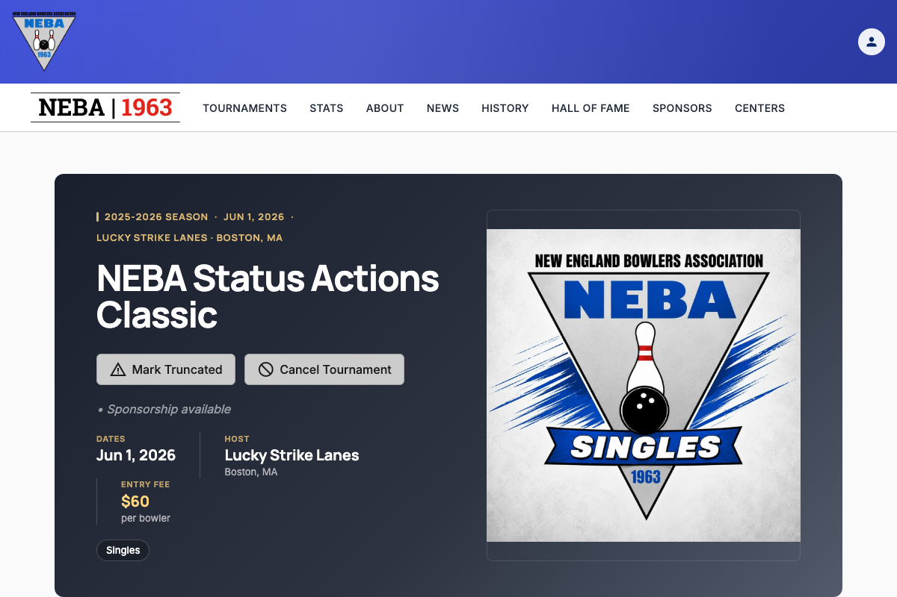
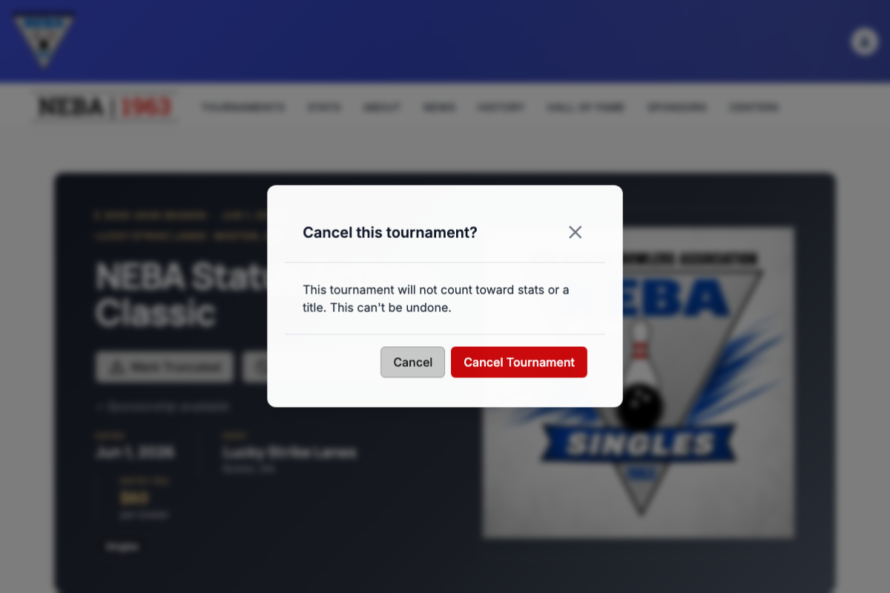

# Cancel a Tournament

Lets a webmaster or admin flag a tournament that never ran as a sanctioned NEBA event under this record — nothing was bowled, or entries were too low to sanction it. The tournament never counts toward stats or a title, but stays visible in the schedule/history for reference.

## Prerequisites

You need the `Tournaments.ManageTournamentStatus` permission, enforced via the dynamic `Permission:Tournaments.ManageTournamentStatus` policy — see the `Permission:{value}` row in [`docs/policies/README.md`](../policies/README.md). If you don't have it, no "Cancel Tournament" button appears on the tournament page.

The action is only available while the tournament's status is **Scheduled** — once it's Completed, Truncated, or Cancelled, the button disappears and the status can no longer be changed.

## Steps

1. Go to the tournament's detail page (`/tournaments/{id}`).
2. Click **Cancel Tournament** near the top of the page.
3. A confirmation dialog titled **"Cancel this tournament?"** appears, explaining that the tournament will not count toward stats or a title. Review it — this step exists because the change is not reversible.
4. Click **Cancel Tournament** to confirm, or **Cancel** to back out and leave the tournament untouched.

## What happens after you confirm

- **Success**: a "Tournament Cancelled" toast confirms the change, and the page updates in place — a **Cancelled** badge appears next to the tournament name, a note explains there are no official results, and the status action buttons disappear (the change is final).
- **Failure**: a "Cancel Failed" toast explains the problem, and the tournament's status is unchanged.

## Troubleshooting

| What you see | What it means |
| --- | --- |
| No "Cancel Tournament" button on the page | Either you don't hold `Tournaments.ManageTournamentStatus` (ask an admin to grant it if you believe you should have it), or the tournament is no longer Scheduled — it's already Completed, Truncated, or Cancelled. |
| "Cancel Failed" toast | The request was rejected by the server. Most commonly this means the tournament was finalized (completed, truncated, or cancelled) by someone else in the moments before your request (a 409 conflict). It can also mean a permission or state problem on the request. The tournament's status was not changed; refresh the page to see its current status. |

## Related

- [`docs/policies/README.md`](../policies/README.md) — the `Permission:{value}` policy this action requires and how it's evaluated.
- [`docs/help/truncate-tournament.md`](truncate-tournament.md) — the equivalent action for a tournament that was held but didn't finish as planned.
- [`docs/help/delete-tournament.md`](delete-tournament.md) — permanently removing a tournament record entirely, a different and unrelated action.
