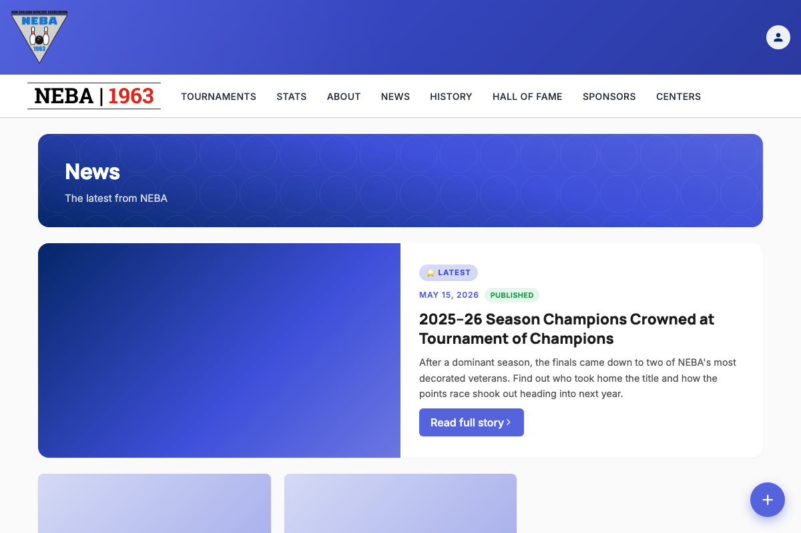
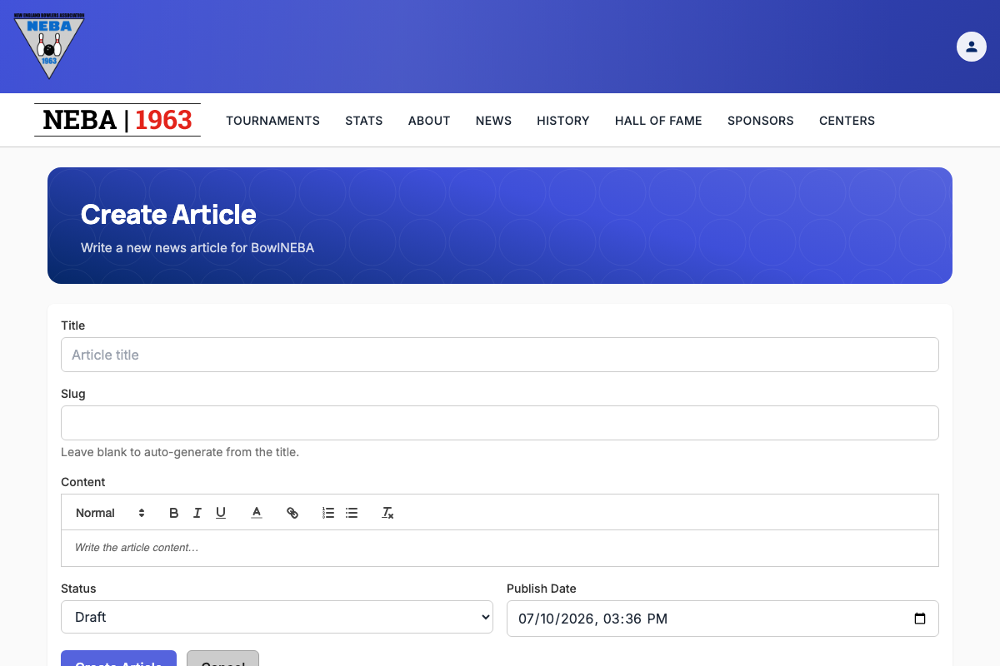

# Create an Article

Lets staff write and publish a news article for the site.

## Prerequisites

You need the `News.CreateArticle` permission (granted to the `Webmaster` and `Admin` roles), enforced via the dynamic `Permission:News.CreateArticle` policy — see the `Permission:{value}` row in [`docs/policies/README.md`](../policies/README.md). If you don't have it, no "Create Article" button appears on the News list page, and `/news/new` shows a "you don't have permission" message instead of the form.

## Steps

1. Go to **News** (`/news`).
2. Click the blue **+** button in the bottom-right corner of the page (the "Create Article" floating action button — this is the standard way to add a new item on any staff-managed list in the app).

   

3. On the **Create Article** page, fill in:
   - **Title** — required.
   - **Slug** — optional. Leave it blank and the URL slug is generated from the title automatically; type your own value only if you want to override that.
   - **Content** — required. Uses the rich text editor (bold/italic/lists/links/headings, etc.).
   - **Status** — `Draft` (not visible to the public) or `Published`.
   - **Publish Date** — shown and entered in your own local time; it's converted to UTC automatically when the article is saved.

   

4. Click **Create Article** to save, or **Cancel** to discard and return to the News list.

## What happens after you confirm

- **Success**: an "Article Created" toast appears and you're taken straight to the new article's detail page (`/news/{slug}`).
- **Failure**: the form stays on screen with an "Unable to Create Article" message explaining what went wrong (see Troubleshooting below) — nothing is saved, and you can fix the form and try again without re-entering everything.

## Troubleshooting

| What you see | What it means |
| --- | --- |
| No "Create Article" button on the News list page, or a "you don't have permission" message on `/news/new` | You don't hold `News.CreateArticle` — ask an admin to grant it if you believe you should have it. |
| "An article with this slug already exists" | Another article is already using that slug (either auto-generated from a matching title, or a typed override). Change the title or supply a different slug and try again — this doesn't require a whole new submission of the rest of the form. |
| "Title must not be empty." / "Content must not be empty." | Title or Content was blank, or Content was entirely stripped during sanitization (e.g. it contained only disallowed markup like a bare script tag). Add real content and try again. |
| Any other "Unable to Create Article" message | The server rejected the request; the message describes the specific problem. The article was not created — correct the issue and submit again. |

## Related

- [`docs/policies/README.md`](../policies/README.md) — the `Permission:{value}` policy this action requires and how it's evaluated.
- [`docs/policies/can-manage-articles.md`](../policies/can-manage-articles.md) — a separate, broader policy that only controls status-badge visibility on News pages, not access to this form.
- [`docs/help/delete-article.md`](delete-article.md) — the equivalent doc for removing an article.
