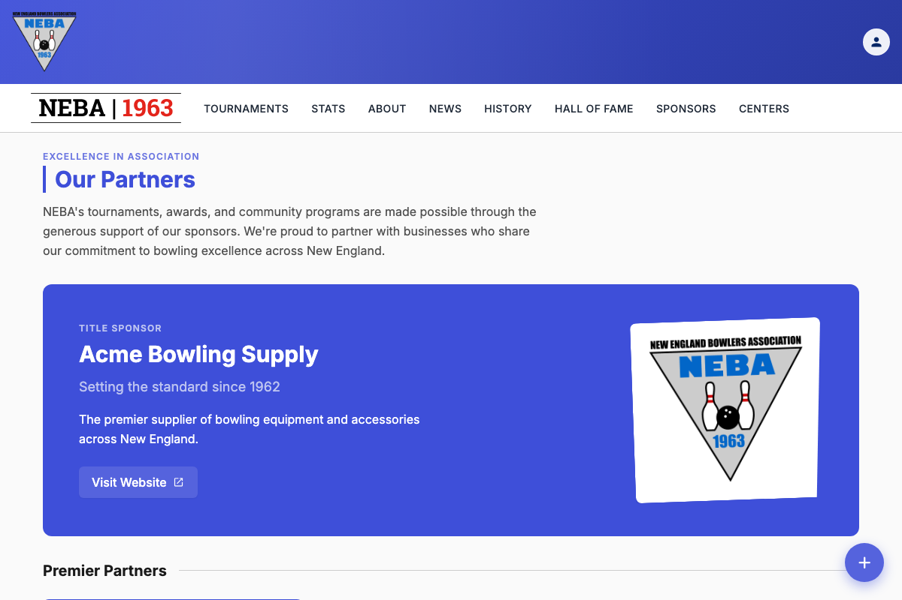
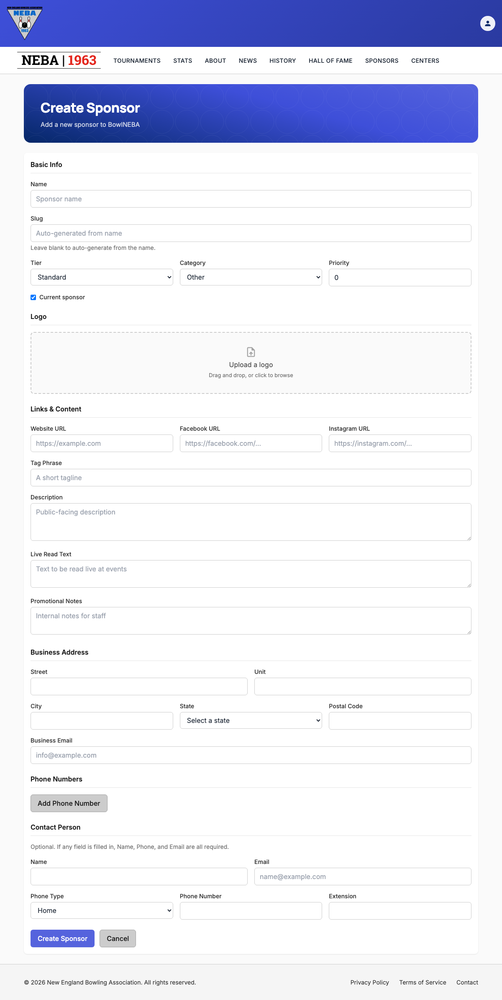

# Create a Sponsor

Lets staff add a new sponsor to BowlNEBA, with its tier, category, contact info, business address, and logo.

## Prerequisites

You need the `Sponsors.CreateSponsor` permission, enforced via the dynamic `Permission:Sponsors.CreateSponsor` policy — see the `Permission:{value}` row in [`docs/policies/README.md`](../policies/README.md). If you don't have it, no "Create Sponsor" button appears on the Sponsors list page, and `/sponsors/new` shows a "you don't have permission" message instead of the form.

## Steps

1. Go to **Sponsors** (`/sponsors`).
2. Click the blue **+** button in the bottom-right corner of the page (the "Create Sponsor" floating action button — this is the standard way to add a new item on any staff-managed list in the app).

   

3. On the **Create Sponsor** page, fill in:
   - **Basic Info** — **Name** (required) and an optional **Slug** (leave blank to auto-generate one from the name — as you type the name, the Slug field's placeholder live-previews the slug that will be generated, e.g. "Acme Bowling & Supply Co." → `acme-bowling-supply-co`; type your own value only if you want to override that preview); **Tier** (Title Sponsor, Premier, or Standard — only one sponsor can hold Title Sponsor at a time), **Category**, and **Priority** (lower numbers sort first within a tier); a **Current sponsor** checkbox (checked by default).
   - **Logo** — optional. Drag and drop, or click to browse for, a single image (up to 5 MB) to use as the sponsor's logo.
   - **Links & Content** — optional **Website URL**, **Facebook URL**, and **Instagram URL** (each must be a full address, e.g. `https://example.com`), plus **Tag Phrase**, **Description**, **Live Read Text**, and **Promotional Notes** (internal staff notes).
   - **Business Address** — optional street, unit, city, state, postal code, and business email.
   - **Phone Numbers** — optional. Click **Add Phone Number** to add a row (type, number, extension); click **Remove** on a row to delete it.
   - **Contact Person** — optional, but if you fill in any of Name, Phone, or Email, all three become required.

   

   The **Create Sponsor** button is disabled while a logo upload is still in progress, so you can't submit with a half-uploaded file.

4. Click **Create Sponsor** to save, or **Cancel** to discard and return to the Sponsors list.

   If you've made any changes and try to leave the page before saving — via **Cancel**, clicking away to another page, or closing/refreshing the browser tab — you're asked to confirm first ("Discard unsaved changes?" with **Leave**/**Stay** options, or your browser's own "leave site?" prompt for a tab close/refresh). Choose **Stay** (or cancel the browser prompt) to keep working on the form.

## What happens after you confirm

- **Success**: a "Sponsor Created" toast appears and you're taken straight to the new sponsor's detail page (`/sponsors/{slug}`).
- **Failure**: the form stays on screen with an "Unable to Create Sponsor" message explaining what went wrong (see Troubleshooting below) — nothing is saved, and you can fix the form and try again without re-entering everything.

## Troubleshooting

| What you see | What it means |
| --- | --- |
| No "Create Sponsor" button on the Sponsors list page, or a "you don't have permission" message on `/sponsors/new` | You don't hold `Sponsors.CreateSponsor` — ask an admin to grant it if you believe you should have it. |
| "A sponsor with this slug already exists." | Another sponsor is already using that slug (either auto-generated from a matching name, or a typed override). Change the name or supply a different slug and try again. |
| "The Title Sponsor tier is already assigned to another sponsor." | Only one sponsor can be the Title Sponsor at a time. Choose a different tier, or first change the existing Title Sponsor's tier before assigning this one. |
| "Name must not be empty." | Name was left blank. Enter a name and try again. |
| "Slug must contain at least one alphanumeric character." or "Slug 'new' is reserved for the sponsor-creation route." | The slug (auto-generated or typed) isn't usable. Adjust the name or type a valid, non-reserved slug and try again. |
| A validation message about a phone number, email address, or URL | One of the supplied values (business email, contact email, a phone number, or a website/Facebook/Instagram link) isn't in a valid format. Correct that field and try again. |
| "If any contact field is supplied, Name, PhoneNumber, and Email are all required." | You filled in one Contact Person field but not the other two. Either fill in all three or clear all three. |
| A red error status next to the logo upload (e.g. "File exceeds the maximum allowed size of 5 MB." / "Upload failed.") | The logo failed to upload — the rest of the form is unaffected. Remove it and try again with a smaller or different file. |
| Any other "Unable to Create Sponsor" message | The server rejected the request; the message describes the specific problem. The sponsor was not created — correct the issue and submit again. |

## Related

- [`docs/policies/README.md`](../policies/README.md) — the `Permission:{value}` policy this action requires and how it's evaluated.
