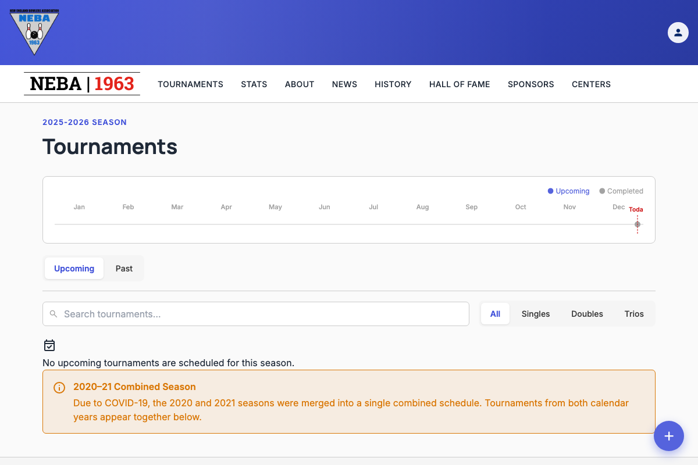
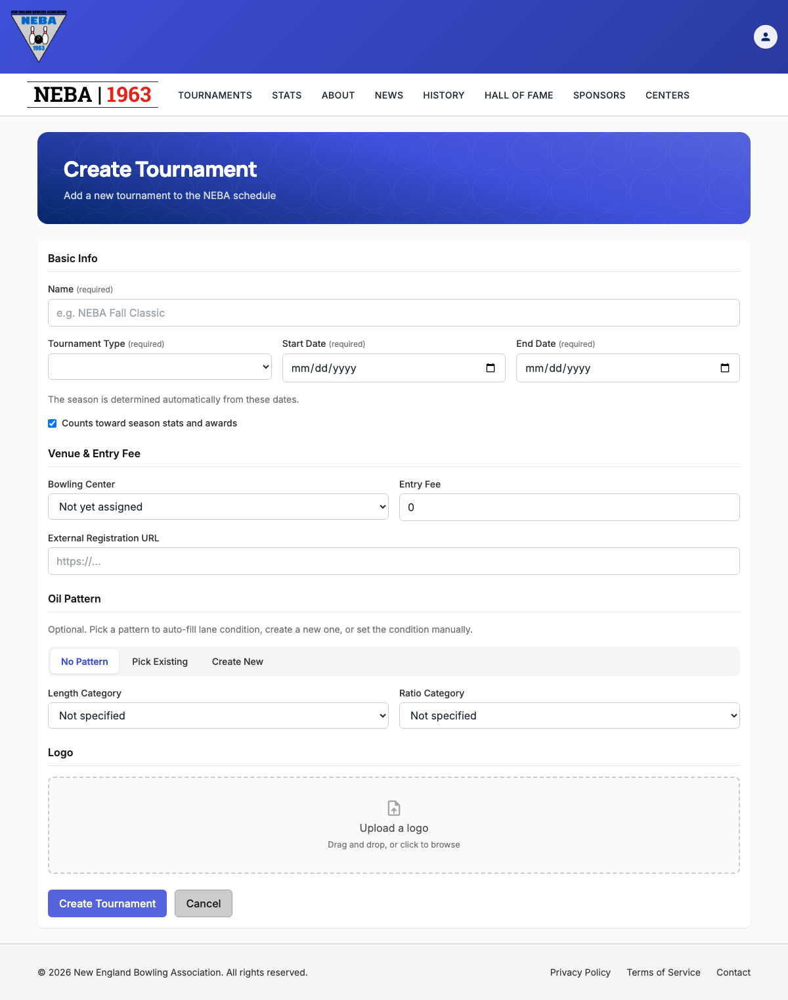

# Create a Tournament

Lets staff add a new tournament to the NEBA schedule, with its type, dates, venue, entry fee, oil pattern, and logo.

## Prerequisites

You need the `Tournaments.CreateTournament` permission, enforced via the dynamic `Permission:Tournaments.CreateTournament` policy — see the `Permission:{value}` row in [`docs/policies/README.md`](../policies/README.md). If you don't have it, no "Create Tournament" button appears on the Tournaments list page, and `/tournaments/new` shows a "you don't have permission" message instead of the form.

## Steps

1. Go to **Tournaments** (`/tournaments`).
2. Click the blue **+** button in the bottom-right corner of the page (the "Create Tournament" floating action button — this is the standard way to add a new item on any staff-managed list in the app).

   

3. On the **Create Tournament** page, fill in:
   - **Basic Info** — **Name** (required), **Tournament Type**, **Start Date**, and **End Date** (all required — the season is determined automatically from the dates, so the dates must fall entirely within one already-configured season), and a **Counts toward season stats and awards** checkbox (checked by default).
   - **Venue & Entry Fee** — an optional **Bowling Center** (defaults to "Not yet assigned") and required **Entry Fee** (zero or greater), plus an optional **External Registration URL** (must be a full address, e.g. `https://example.com`, if provided).
   - **Oil Pattern** — optional. Choose one of three modes with the segmented control: **No Pattern** (optionally set Length/Ratio category manually), **Pick Existing** (choose a pattern from NEBA's pattern library — its length, ratio, and categories display once selected), or **Create New** (enter a new pattern's name, Kegel ID, length, volume, and ratios, then click **Add Pattern** to save it to the library and select it immediately). You can provide either an existing/new oil pattern or manual categories, not both.
   - **Logo** — optional. Drag and drop, or click to browse for, a single image (up to 5 MB) to use as the tournament's logo.

   

   The **Create Tournament** button is disabled while a logo upload is still in progress, so you can't submit with a half-uploaded file.

4. Click **Create Tournament** to save, or **Cancel** to discard and return to the Tournaments list.

   If you've made any changes and try to leave the page before saving — via **Cancel**, clicking away to another page, or closing/refreshing the browser tab — you're asked to confirm first ("Discard unsaved changes?" with **Leave**/**Stay** options, or your browser's own "leave site?" prompt for a tab close/refresh). Choose **Stay** (or cancel the browser prompt) to keep working on the form.

## What happens after you confirm

- **Success**: a "Tournament Created" toast appears and you're taken straight to the new tournament's detail page (`/tournaments/{id}`).
- **Failure**: the form stays on screen with an "Unable to Create Tournament" message explaining what went wrong (see Troubleshooting below) — nothing is saved, and you can fix the form and try again without re-entering everything.

## Troubleshooting

| What you see | What it means |
| --- | --- |
| No "Create Tournament" button on the Tournaments list page, or a "you don't have permission" message on `/tournaments/new` | You don't hold `Tournaments.CreateTournament` — ask an admin to grant it if you believe you should have it. |
| "No season is configured that contains these tournament dates." | The Start Date/End Date range doesn't fall entirely within any existing season. Adjust the dates, or ask an admin to configure a season covering that range. |
| "The specified bowling center was not found." | The selected bowling center no longer exists or its certification number is invalid. Choose a different center or leave it unassigned. |
| "The specified oil pattern was not found." | The picked oil pattern no longer exists in the library. Re-select a pattern, create a new one, or switch to manual categories/No Pattern. |
| "Name is required.", "Tournament type is required.", "Start date is required.", "End date is required.", or "Entry fee must be zero or greater." | A required field was left blank or invalid. Fill it in and try again. |
| A validation message about the external registration URL | The URL isn't a valid, absolute address (e.g. missing `https://`). Correct it and try again. |
| A red error status next to the logo upload (e.g. "File exceeds the maximum allowed size of 5 MB." / "Upload failed.") | The logo failed to upload — the rest of the form is unaffected. Remove it and try again with a smaller or different file. |
| Any other "Unable to Create Tournament" message | The server rejected the request; the message describes the specific problem. The tournament was not created — correct the issue and submit again. |

## Related

- [`docs/policies/README.md`](../policies/README.md) — the `Permission:{value}` policy this action requires and how it's evaluated.
