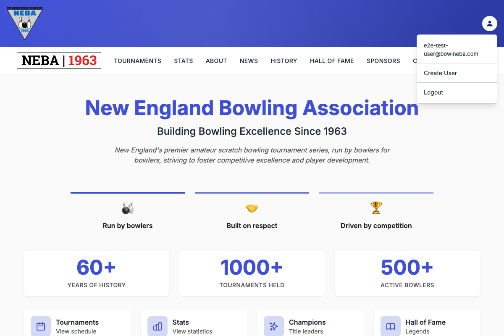
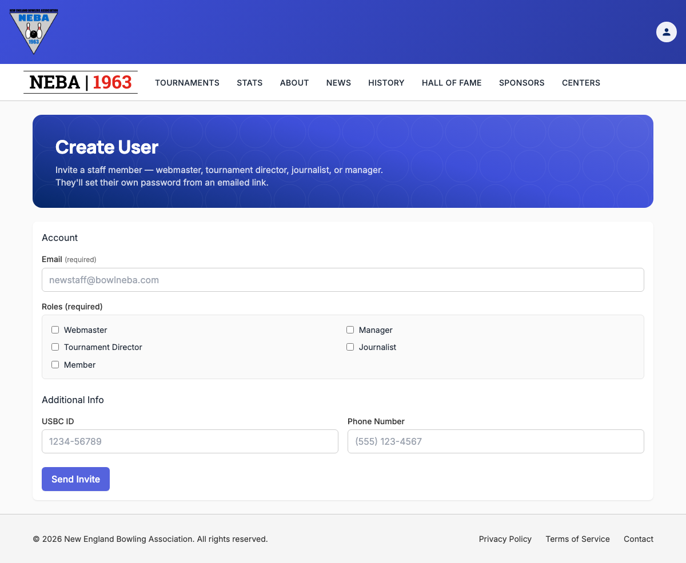
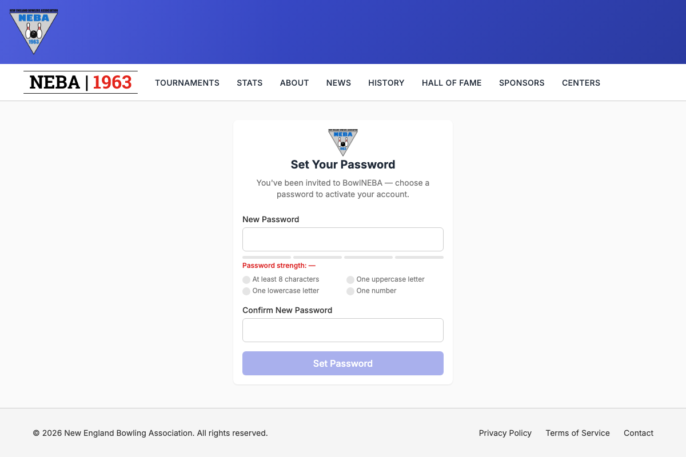

# Create a User

Lets an admin invite a new staff member — webmaster, manager, tournament director, journalist, or member — without setting a password for them. The invitee gets an email and sets their own password.

## Prerequisites

You need the `System.CreateUser` permission, enforced via the dynamic `Permission:System.CreateUser` policy — see the `Permission:{value}` row in [`docs/policies/README.md`](../policies/README.md). If you don't have it, no "Create User" option appears in the account menu, and `/account/create-user` shows a "you don't have permission" message instead of the form.

## Steps

1. Click the account icon in the top-right corner to open the account menu, then click **Create User**.

   

2. On the **Create User** page, fill in:
   - **Email** (required).
   - **Roles** (required, at least one) — check any combination of Webmaster, Manager, Tournament Director, Journalist, and Member. The Admin role can't be granted from this form.
   - **USBC ID** and **Phone Number** — both optional.

   

3. Click **Send Invite** to create the account and email the invite, or navigate away to discard.

   If you've filled in anything and try to leave the page before submitting — clicking away to another page, or closing/refreshing the browser tab — you're asked to confirm first ("Discard unsaved changes?" with **Leave**/**Stay** options, or your browser's own "leave site?" prompt for a tab close/refresh).

## What happens after you confirm

- **Success**: an "Invite Sent" message confirms the account was created, and the form clears so you can invite another person. The invitee receives an email with a **Set Your Password** button/link.
- **Failure**: an "Unable to Create User" message explains what went wrong (see Troubleshooting below) — nothing is saved, and the form stays filled in so you can fix it and try again.

## Setting the password (invite flow)

The invite email's link opens `/account/set-password` with the new user's id and a one-time token embedded in the URL. This page has no permission requirement — anyone holding a valid, unexpired link can use it.

1. The invitee opens the link from their email and lands on the **Set Your Password** page.
2. They type a password into **New Password** and repeat it in **Confirm New Password**. A strength meter and a checklist (at least 8 characters, one uppercase letter, one lowercase letter, one number) update as they type.

   

3. They click **Set Password**.

On success, the token is consumed (it can't be reused), the account's email is marked confirmed, and the invitee is redirected to the login page with a "Your password has been set — you can now log in" message. On failure (an expired or already-used link, or a password that doesn't meet the requirements), an error message appears and the link must be re-requested from an admin — this page can't tell the invitee whether the problem was the link or the password, to avoid revealing whether a given user id exists.

## Troubleshooting

| What you see | What it means |
| --- | --- |
| No "Create User" option in the account menu, or a "you don't have permission" message on `/account/create-user` | You don't hold `System.CreateUser` — ask an admin to grant it if you believe you should have it. |
| "An account with this email already exists." | Someone has already been invited or registered with that email. Use a different email, or ask an admin to resend the existing invite. |
| "At least one role is required." | No role checkbox was selected. Pick at least one and try again. |
| "The Admin role cannot be granted through this endpoint." or "One or more roles are not recognized." | This shouldn't happen from the form itself, since only valid, non-Admin roles are offered as checkboxes — if you see it, try again or contact support. |
| Any other "Unable to Create User" message | The server rejected the request; the message describes the specific problem. The account was not created — correct the issue and submit again. |
| "This invite link is invalid or has expired." (on the Set Password page) | The link was already used, or has expired, or the password entered didn't meet the requirements shown on the page. Ask an admin to send a new invite. |

## Related

- [`docs/policies/README.md`](../policies/README.md) — the `Permission:{value}` policy this action requires and how it's evaluated.
