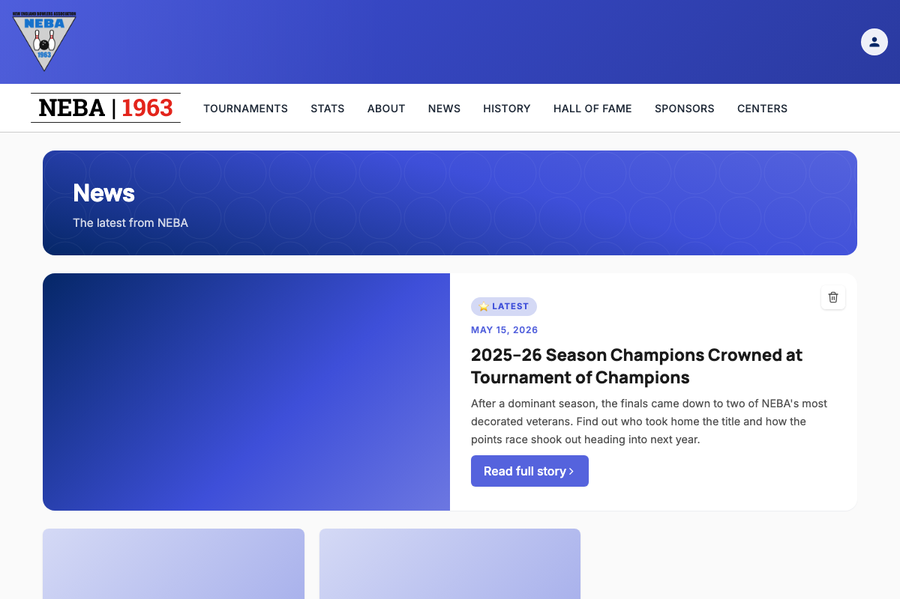
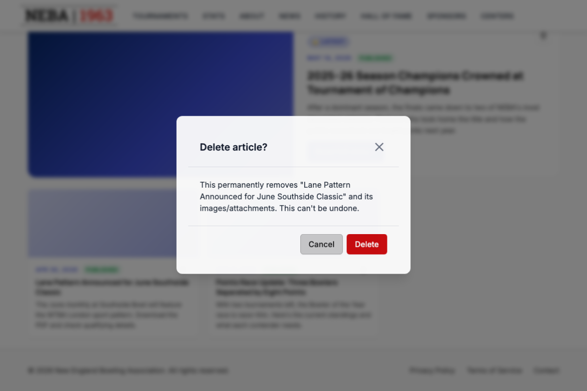
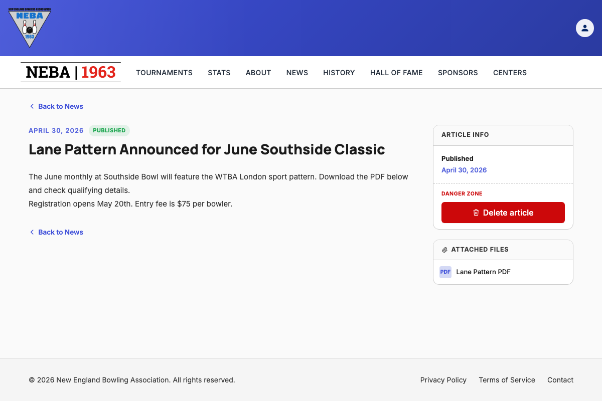
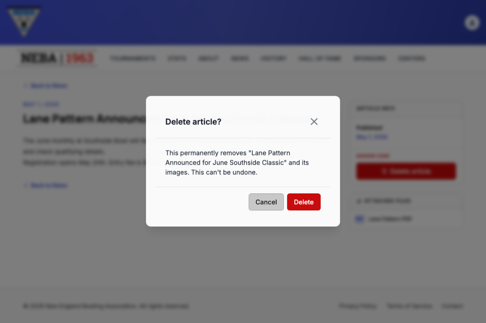

# Delete an Article

Lets a webmaster or admin permanently remove a published news article from the site.

## Prerequisites

You need the `News.DeleteArticle` permission (granted to the `Webmaster` and `Admin` roles), enforced via the dynamic `Permission:News.DeleteArticle` policy — see the `Permission:{value}` row in [`docs/policies/README.md`](../policies/README.md). If you don't have it, no delete controls appear anywhere in the News section.

## Steps

You can delete an article from either the News list page or the article's own detail page.

### From the News list page (`/news`)

1. Go to **News** (`/news`).
2. Find the article you want to remove.
   - For the featured/hero article at the top of the page, click the delete icon on the hero card.
   - For any other article, click the delete icon on its card in the grid below.
3. A confirmation dialog titled **"Delete article?"** appears, naming the specific article. Review it — this step exists because deletion is not reversible.
4. Click **Confirm** to delete, or **Cancel** to back out and leave the article untouched.

### From an article's detail page (`/news/{slug}`)

1. Open the article you want to remove.
2. In the sidebar, find the **Danger zone** panel and click its delete button.
3. Confirm the same **"Delete article?"** dialog as above.
4. On success you're returned to the News list (`/news`).

## What happens after you confirm

- **Success**: a "Article Deleted" toast confirms the article was removed.
  - From the list page, the card (or hero) disappears immediately — you stay on `/news`.
  - From the detail page, you're redirected to `/news`.
- **Failure**: a "Delete Failed" toast explains the problem, and you stay on the page you were on. If you were on the detail page and it can no longer load the article's current state, you'll see an "Error Loading Article" message instead.

## Troubleshooting

| What you see | What it means |
| --- | --- |
| No delete icon/button anywhere in News | You don't hold `News.DeleteArticle` — ask an admin to grant it if you believe you should have it. |
| "Delete Failed" toast | The delete request was rejected by the server (e.g. a permission or state problem). The article was not removed; try again or contact support if it persists. |
| "Error Loading Article" after confirming on the detail page | The delete may have gone through, but the page couldn't reload the article to reflect it — check the News list to see if it's still there. |

## Related

- [`docs/policies/README.md`](../policies/README.md) — the `Permission:{value}` policy this action requires and how it's evaluated.
- [`docs/policies/can-manage-articles.md`](../policies/can-manage-articles.md) — the broader `CanManageArticles` policy (satisfied by holding either `News.CreateArticle` or `News.DeleteArticle`), which only drives status-badge visibility. Deletion itself still gates on `Permission:News.DeleteArticle` directly, not this policy.
- [`docs/help/create-article.md`](create-article.md) — the equivalent doc for adding an article.
