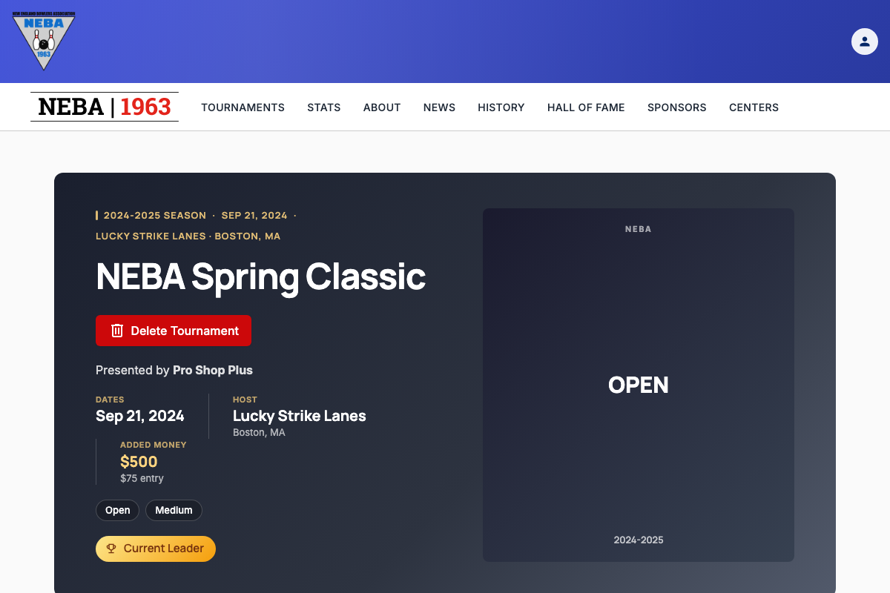
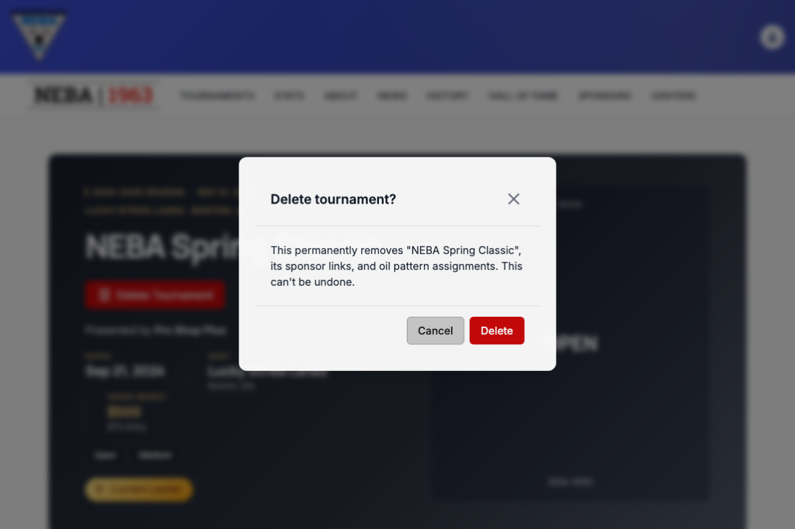

# Delete a Tournament

Lets a webmaster or admin permanently remove a tournament from the site.

## Prerequisites

You need the `Tournaments.DeleteTournament` permission, enforced via the dynamic `Permission:Tournaments.DeleteTournament` policy — see the `Permission:{value}` row in [`docs/policies/README.md`](../policies/README.md). If you don't have it, no delete button appears on the tournament page.

## Steps

1. Go to the tournament's detail page (`/tournaments/{id}`).
2. Click **Delete Tournament** near the top of the page.
3. A confirmation dialog titled **"Delete tournament?"** appears, naming the specific tournament and warning that its sponsor links and oil pattern assignments are removed too. Review it — this step exists because deletion is not reversible.
4. Click **Confirm** to delete, or **Cancel** to back out and leave the tournament untouched.

## What happens after you confirm

- **Success**: a "Tournament Deleted" toast confirms removal, and you're redirected to the tournament schedule (`/tournaments`).
- **Failure**: a "Delete Failed" toast explains the problem, and you stay on the tournament's page with nothing removed.

## Troubleshooting

| What you see | What it means |
| --- | --- |
| No "Delete Tournament" button on the page | You don't hold `Tournaments.DeleteTournament` — ask an admin to grant it if you believe you should have it. |
| "Delete Failed" toast | The delete request was rejected by the server. Most commonly this means the tournament has recorded championship, entry, or result history and cannot be deleted (a 409 conflict). It can also mean a permission or state problem on the request. The tournament was not removed; try again or contact support if it persists. |

## Related

- [`docs/policies/README.md`](../policies/README.md) — the `Permission:{value}` policy this action requires and how it's evaluated.
- [`docs/help/edit-tournament.md`](edit-tournament.md) — the equivalent doc for changing a tournament's details instead of removing it.
