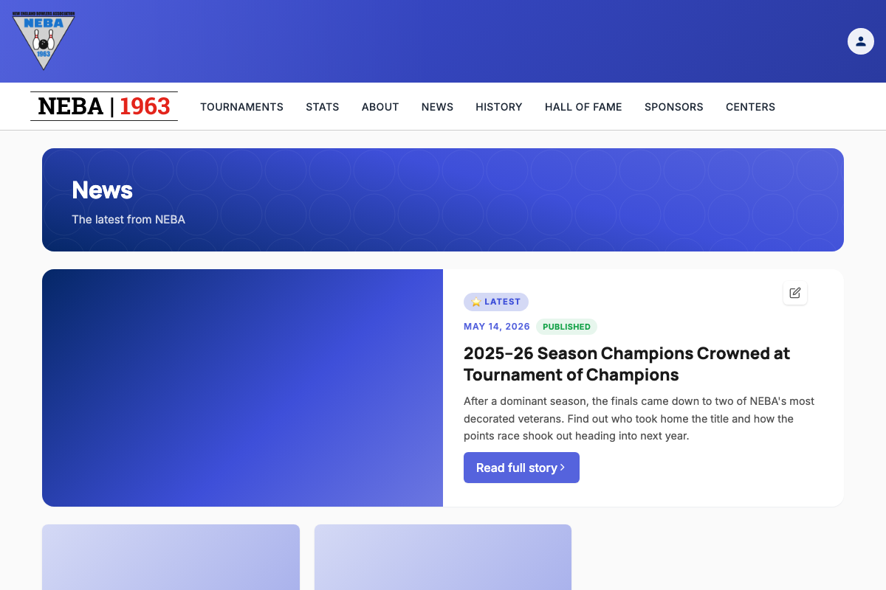
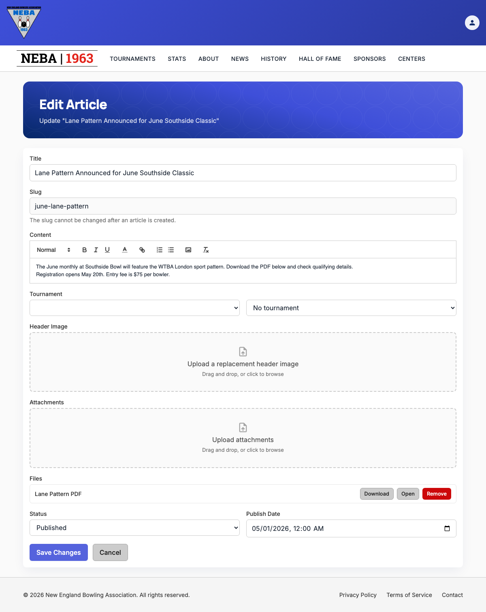

# Edit an Article

Lets a webmaster or admin update an existing news article's content, status, publish date, tournament link, header image, and attachments.

## Prerequisites

You need the `News.EditArticle` permission (granted to the `Webmaster` and `Admin` roles), enforced via the dynamic `Permission:News.EditArticle` policy — see the `Permission:{value}` row in [`docs/policies/README.md`](../policies/README.md). If you don't have it, no edit controls appear anywhere in the News section, and `/news/{slug}/edit` shows a "you don't have permission" message instead of the form.

## Steps

You can start editing from the News list page or an article's own detail page — all three entry points open the same edit form at `/news/{slug}/edit`.

### From the News list page (`/news`)

- For the featured/hero article at the top of the page, click the pencil (edit) icon on the hero card.
- For any other article, click the pencil icon on its card in the grid below.

### From an article's detail page (`/news/{slug}`)

- In the sidebar, click **Edit Article**.

### The edit form

Once on the edit page, update any of:

- **Title** — required.
- **Slug** — shown as read-only text; it cannot be changed after an article is created.
- **Content** — required. Uses the rich text editor (bold/italic/lists/links/headings, etc.). You can also drag an image directly into the editor (or use its image button) to embed it inline in the article body — this uploads the image immediately and inserts it at the cursor.
- **Tournament** — if the article is already linked to a tournament, its name is shown as read-only text with a **Change tournament** button; click it to switch to the season/tournament dropdowns. If it's not linked, pick a season and then a tournament within that season, or leave both as-is to keep no tournament link.
- **Header Image** — the current header image (if any) is shown with a **Remove current image** button. Drag and drop, or click to browse for, a replacement image (JPEG/PNG/etc., up to 5 MB).
- **Attachments** — existing attachments are listed with **Download**, **Open**, and **Remove** actions. Drag and drop, or click to browse for, additional files (PDF, Word, Excel, or images, up to 25 MB each) to add — up to 10 total. Any image embedded inline in the Content editor also appears here, tagged **Inline**, alongside any files added through this uploader.
- **Status** — `Draft` (not visible to the public) or `Published`.
- **Publish Date** — shown and entered in your own local time; it's converted to UTC automatically when the article is saved.

Removing a regular attachment just drops it from the list; removing an inline embedded image (used in the article body) asks you to confirm first, since the image will still appear — broken — wherever you embedded it in the content, and you'll need to edit the body yourself to fully remove or replace it.

The **Save Changes** button is disabled while any header image or attachment upload is still in progress, so you can't submit with a half-uploaded file.

Click **Save Changes** to save, or **Cancel** to discard and return to the article's detail page.

If you've made any changes and try to leave the page before saving — via **Cancel**, clicking away to another page, or closing/refreshing the browser tab — you're asked to confirm first ("Discard unsaved changes?" with **Leave**/**Stay** options, or your browser's own "leave site?" prompt for a tab close/refresh). Choose **Stay** (or cancel the browser prompt) to keep working on the form.

## What happens after you confirm

- **Success**: an "Article Updated" toast appears and you're taken back to the article's detail page (`/news/{slug}`).
- **Failure**: the form stays on screen with an "Unable to Save Article" message explaining what went wrong (see Troubleshooting below) — nothing is saved, and you can fix the form and try again without re-entering everything.

## Troubleshooting

| What you see | What it means |
| --- | --- |
| No edit icon/button anywhere in News, or a "you don't have permission" message on `/news/{slug}/edit` | You don't hold `News.EditArticle` — ask an admin to grant it if you believe you should have it. |
| "This article could not be found." | The article's slug no longer exists (e.g. it was deleted by someone else since you navigated here). Go back to the News list. |
| "Title must not be empty." / "Content must not be empty." | Title or Content was blank, or Content was entirely stripped during sanitization (e.g. it contained only disallowed markup like a bare script tag). Add real content and try again. |
| A red error status next to a file in the Header Image or Attachments list (e.g. "File exceeds the maximum allowed size of 5 MB." / "Upload failed.") | That individual file failed to upload — the rest of the form is unaffected. Remove it and try again with a smaller file or a different file. |
| "TournamentId must be a 26-character ULID." or "The specified tournament does not exist." | The linked tournament no longer exists or wasn't recognized. Use **Change tournament** to re-pick the season and tournament from the dropdowns and try again. |
| "Article with slug not found." (as the save error, not the page load error) | The article was deleted by someone else after you opened the edit page but before you saved. Go back to the News list — there's nothing left to save. |
| Any other "Unable to Save Article" message | The server rejected the request; the message describes the specific problem. Your changes were not saved — correct the issue and submit again. |

## Related

- [`docs/policies/README.md`](../policies/README.md) — the `Permission:{value}` policy this action requires and how it's evaluated.
- [`docs/policies/can-manage-articles.md`](../policies/can-manage-articles.md) — a separate, broader policy that only controls status-badge visibility on News pages, not access to this form.
- [`docs/help/create-article.md`](create-article.md) — the equivalent doc for adding a new article.
- [`docs/help/delete-article.md`](delete-article.md) — how to remove an article entirely.
