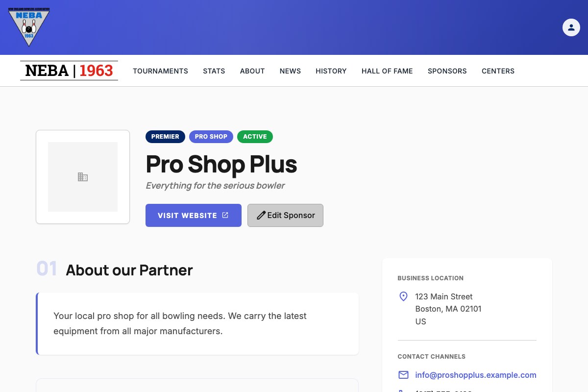
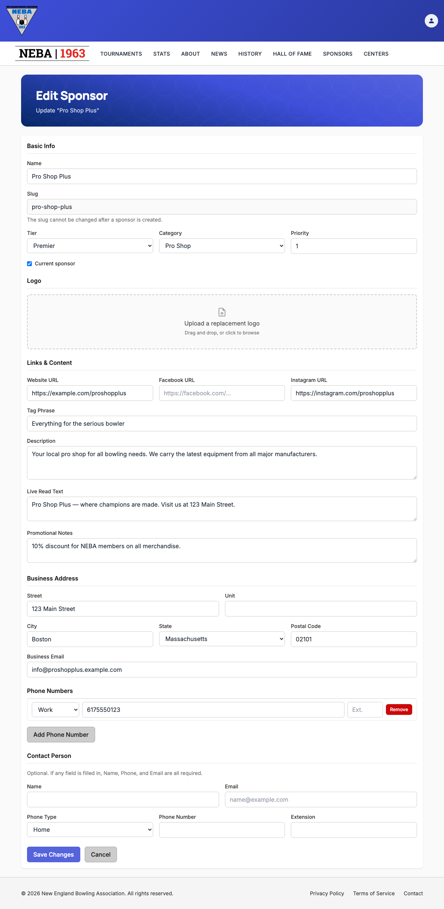

# Edit a Sponsor

Lets staff update an existing sponsor's fields — tier, category, contact info, business address, logo, and more. The sponsor's slug can't be changed.

## Prerequisites

You need the `Sponsors.EditSponsor` permission, enforced via the dynamic `Permission:Sponsors.EditSponsor` policy — see the `Permission:{value}` row in [`docs/policies/README.md`](../policies/README.md). If you don't have it, no edit buttons appear anywhere on the Sponsors pages, and going directly to `/sponsors/{slug}/edit` shows a "you don't have permission" message instead of the form.

Callers with `Sponsors.EditSponsor` (or `Sponsors.CreateSponsor`) also see extra staff-only information on a sponsor's detail page — see [`can-manage-sponsors.md`](../policies/can-manage-sponsors.md) for what that broader `CanManageSponsors` visibility policy covers.

## Steps

1. Get to a sponsor's edit page one of two ways:
   - From the **Sponsors** list (`/sponsors`): click the pencil icon on the sponsor's tile — this appears on the Title Sponsor banner, a Premier Partner card, an Association Sponsor tile, or an Inactive Sponsors tile, depending on where the sponsor is displayed.
   - From a sponsor's own detail page (`/sponsors/{slug}`): click **Edit Sponsor** next to the Visit Website button.

   

2. On the **Edit Sponsor** page, update any of:
   - **Basic Info** — **Name**, **Tier** (Title Sponsor, Premier, or Standard — only one sponsor can hold Title Sponsor at a time), **Category**, **Priority** (lower numbers sort first within a tier), and the **Current sponsor** checkbox. The **Slug** is shown read-only and cannot be changed.
   - **Logo** — the current logo (if any) is shown with a **Remove current logo** button; drag and drop, or click to browse for, a replacement image (up to 5 MB) via the upload control. Leaving the logo untouched keeps the existing one.
   - **Links & Content** — **Website URL**, **Facebook URL**, **Instagram URL** (each must be a full address, e.g. `https://example.com`), **Tag Phrase**, **Description**, **Live Read Text**, and **Promotional Notes** (internal staff notes).
   - **Business Address** — street, unit, city, state, postal code, and business email.
   - **Phone Numbers** — a full replace-set: click **Add Phone Number** to add a row (type, number, extension), or **Remove** on a row to delete it. Whatever rows are present when you save become the sponsor's complete phone number list.
   - **Contact Person** — optional, but if you fill in any of Name, Phone, or Email, all three become required.

   

   The **Save Changes** button is disabled while a logo upload is still in progress, so you can't submit with a half-uploaded file.

3. Click **Save Changes** to save, or **Cancel** to discard and return to the sponsor's detail page.

   If you've made any changes and try to leave the page before saving — via **Cancel**, clicking away to another page, or closing/refreshing the browser tab — you're asked to confirm first ("Discard unsaved changes?" with **Leave**/**Stay** options, or your browser's own "leave site?" prompt for a tab close/refresh). Choose **Stay** (or cancel the browser prompt) to keep working on the form.

## What happens after you confirm

- **Success**: a "Sponsor Updated" toast appears and you're taken back to the sponsor's detail page (`/sponsors/{slug}`).
- **Failure**: the form stays on screen with an "Unable to Save Sponsor" message explaining what went wrong (see Troubleshooting below) — nothing is saved, and you can fix the form and try again without re-entering everything.

## Troubleshooting

| What you see | What it means |
| --- | --- |
| No edit buttons on the Sponsors pages, or a "you don't have permission" message on `/sponsors/{slug}/edit` | You don't hold `Sponsors.EditSponsor` — ask an admin to grant it if you believe you should have it. |
| "This sponsor could not be found." | The sponsor's slug no longer exists (it may have been removed). Go back to the Sponsors list and try again. |
| "The Title Sponsor tier is already assigned to another sponsor." | Only one sponsor can be the Title Sponsor at a time. Choose a different tier, or first change the existing Title Sponsor's tier before assigning this one. |
| "Name must not be empty." | Name was left blank. Enter a name and try again. |
| A validation message about a phone number, email address, or URL | One of the supplied values (business email, contact email, a phone number, or a website/Facebook/Instagram link) isn't in a valid format. Correct that field and try again. |
| "If any contact field is supplied, Name, PhoneNumber, and Email are all required." | You filled in one Contact Person field but not the other two. Either fill in all three or clear all three. |
| A red error status next to the logo upload (e.g. "File exceeds the maximum allowed size of 5 MB." / "Upload failed.") | The logo failed to upload — the rest of the form is unaffected. Remove it and try again with a smaller or different file. |
| Any other "Unable to Save Sponsor" message | The server rejected the request; the message describes the specific problem. The sponsor was not updated — correct the issue and submit again. |

## Related

- [`docs/policies/README.md`](../policies/README.md) — the `Permission:{value}` policy this action requires and how it's evaluated.
- [`can-manage-sponsors.md`](../policies/can-manage-sponsors.md) — the broader visibility policy that also gates staff-only info on the sponsor detail page.
- [`create-sponsor.md`](create-sponsor.md) — adding a new sponsor, which this edit form's fields mirror.
