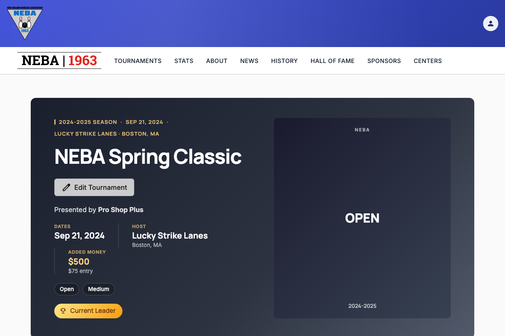
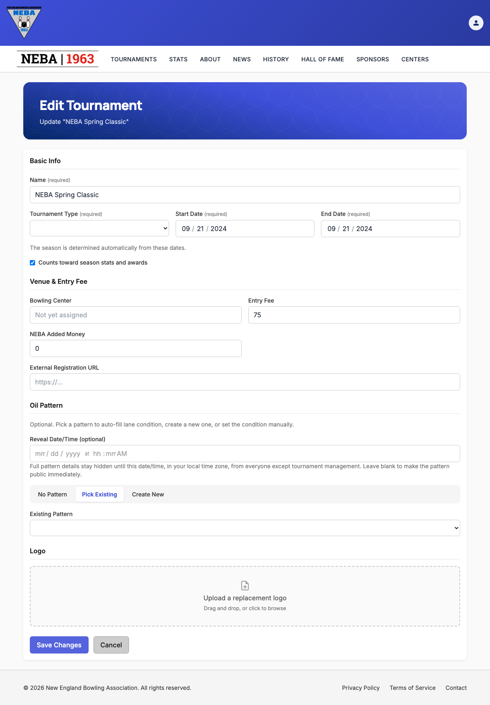

# Edit a Tournament

Lets staff update an existing tournament's details — name, type, dates, venue, entry fee, oil pattern, and logo.

## Prerequisites

You need the `Tournaments.EditTournament` permission, enforced via the dynamic `Permission:Tournaments.EditTournament` policy — see the `Permission:{value}` row in [`docs/policies/README.md`](../policies/README.md). If you don't have it, no "Edit Tournament" button appears on the tournament's detail page, and `/tournaments/{id}/edit` shows a "you don't have permission" message instead of the form.

## Steps

1. Go to the tournament's detail page (`/tournaments/{id}`).
2. Click **Edit Tournament** next to the tournament name.

   

3. On the **Edit Tournament** page, the form is pre-filled with the tournament's current values. Update any of:
   - **Basic Info** — **Name**, **Tournament Type**, **Start Date**, and **End Date** (all required — the season is re-derived automatically from the dates, so the dates must fall entirely within one already-configured season), and the **Counts toward season stats and awards** checkbox.
   - **Venue & Entry Fee** — an optional **Bowling Center**, required **Entry Fee** (zero or greater), and **NEBA Added Money** (zero or greater — money NEBA itself adds to the prize fund, shown to bowlers as "Added money" instead of the entry fee whenever it's set), plus an optional **External Registration URL** (must be a full address, e.g. `https://example.com`, if provided).
   - **Oil Pattern** — optional. Set an optional **Reveal Date/Time** (in your local time zone) to keep the pattern's full details hidden from everyone except tournament management until that moment — leave it blank to make the pattern public immediately. Then choose one of three modes with the segmented control: **No Pattern** (optionally set Length/Ratio category manually), **Pick Existing** (choose a pattern from NEBA's pattern library), or **Create New** (add a new pattern to the library and select it immediately). You can provide either an existing/new oil pattern or manual categories, not both.
   - **Logo** — if a logo is already set, it's shown with a **Remove current logo** button. Drag and drop, or click to browse for, a replacement image (up to 5 MB).

   

   The **Save Changes** button is disabled while a logo upload is still in progress, so you can't submit with a half-uploaded file.

4. Click **Save Changes** to save, or **Cancel** to discard and return to the tournament's detail page.

   If you've made any changes and try to leave the page before saving — via **Cancel**, clicking away to another page, or closing/refreshing the browser tab — you're asked to confirm first ("Discard unsaved changes?" with **Leave**/**Stay** options, or your browser's own "leave site?" prompt for a tab close/refresh). Choose **Stay** (or cancel the browser prompt) to keep working on the form.

## What happens after you confirm

- **Success**: a "Tournament Updated" toast appears and you're taken back to the tournament's detail page (`/tournaments/{id}`).
- **Failure**: the form stays on screen with an "Unable to Save Tournament" message explaining what went wrong (see Troubleshooting below) — nothing is saved, and you can fix the form and try again without re-entering everything.

## Troubleshooting

| What you see | What it means |
| --- | --- |
| No "Edit Tournament" button on the tournament's detail page, or a "you don't have permission" message on `/tournaments/{id}/edit` | You don't hold `Tournaments.EditTournament` — ask an admin to grant it if you believe you should have it. |
| "This tournament could not be found." | The tournament was deleted, or the link/ID is wrong. Return to the Tournaments list and find it again. |
| "No season is configured that contains these tournament dates." | The Start Date/End Date range doesn't fall entirely within any existing season. Adjust the dates, or ask an admin to configure a season covering that range. |
| "The specified bowling center was not found." | The selected bowling center no longer exists or its certification number is invalid. Choose a different center or leave it unassigned. |
| "The specified oil pattern was not found." | The picked oil pattern no longer exists in the library. Re-select a pattern, create a new one, or switch to manual categories/No Pattern. |
| "Name is required.", "Tournament type is required.", "Start date is required.", "End date is required.", "Entry fee must be zero or greater.", or "NEBA added money must be zero or greater." | A required field was left blank or invalid. Fill it in and try again. |
| A validation message about the external registration URL | The URL isn't a valid, absolute address (e.g. missing `https://`). Correct it and try again. |
| A red error status next to the logo upload (e.g. "File exceeds the maximum allowed size of 5 MB." / "Upload failed.") | The logo failed to upload — the rest of the form is unaffected. Remove it and try again with a smaller or different file. |
| Any other "Unable to Save Tournament" message | The server rejected the request; the message describes the specific problem. The tournament was not updated — correct the issue and submit again. |

## Related

- [`docs/policies/README.md`](../policies/README.md) — the `Permission:{value}` policy this action requires and how it's evaluated.
- [`docs/help/create-tournament.md`](create-tournament.md) — the equivalent doc for adding a new tournament.