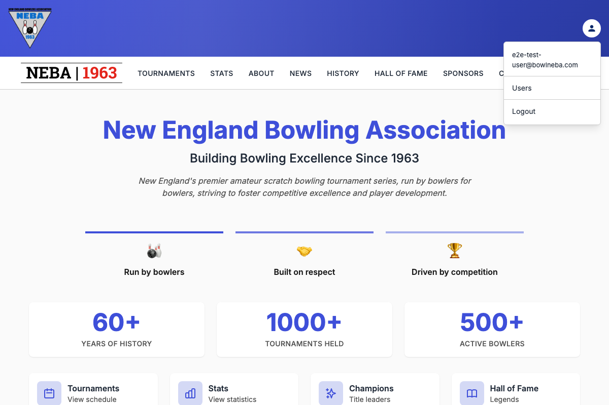
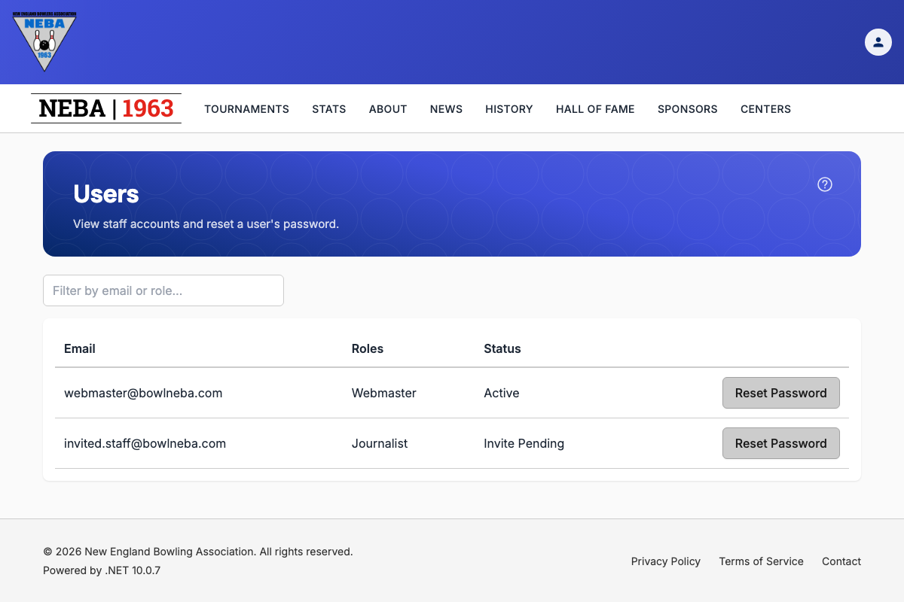
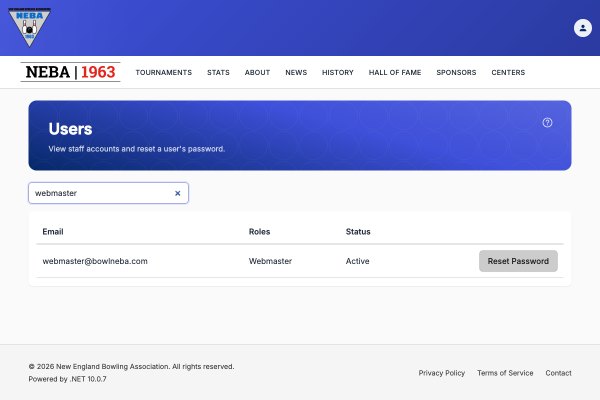

# View Users

Lets an admin see every staff account in the system — email, roles, and whether the account is active or still pending its initial invite — and filter or page through the list.

## Prerequisites

You need the `System.GetUsers` permission, enforced via the dynamic `Permission:System.GetUsers` policy — see the `Permission:{value}` row in [`docs/policies/README.md`](../policies/README.md). If you don't have it, no "Users" option appears in the account menu, and `/account/users` shows a "you don't have permission" message instead of the list.

## Steps

1. Click the account icon in the top-right corner to open the account menu, then click **Users**.

   

2. The **Users** page shows every staff account in a table — **Email**, **Roles**, and **Status** (**Active** once the account has confirmed its email and set a password, or **Invite Pending** until then).

   

3. Type into the filter box above the table to narrow the list to accounts matching what you type — it matches against either the email address or any assigned role.

   

4. If there are more than 20 accounts, page controls appear below the table — click a page number, or the previous/next arrows, to move through the list. The filter box only searches the accounts on the current page.

## Related actions

Resetting a user's password is a separate action available from this same page — see [Reset a User's Password](reset-password.md) for that flow.

## Troubleshooting

| What you see | What it means |
| --- | --- |
| No "Users" option in the account menu, or a "you don't have permission" message on `/account/users` | You don't hold `System.GetUsers` — ask an admin to grant it if you believe you should have it. |
| "Error Loading Users" alert | The server request failed; the message describes the specific problem. Try refreshing the page. |
| "No users match "..."" in the table | The filter text doesn't match any email or role on the current page. Clear the filter, or check the other pages. |

## Related

- [Create a User](create-user.md) — invites a new staff account.
- [Reset a User's Password](reset-password.md) — forces a fresh set-password link for an existing user, reachable from this page's table.
- [`docs/policies/README.md`](../policies/README.md) — the `Permission:{value}` policy this action requires and how it's evaluated.
