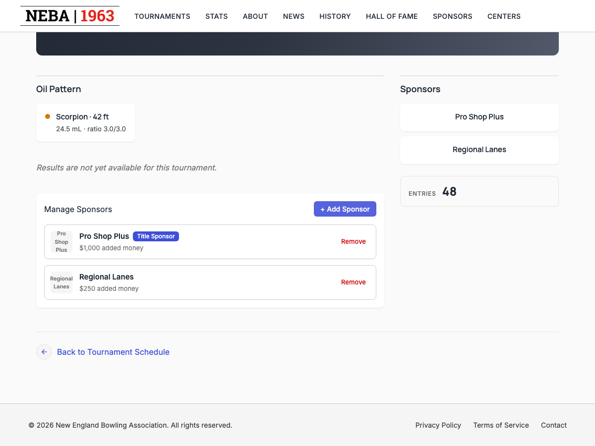
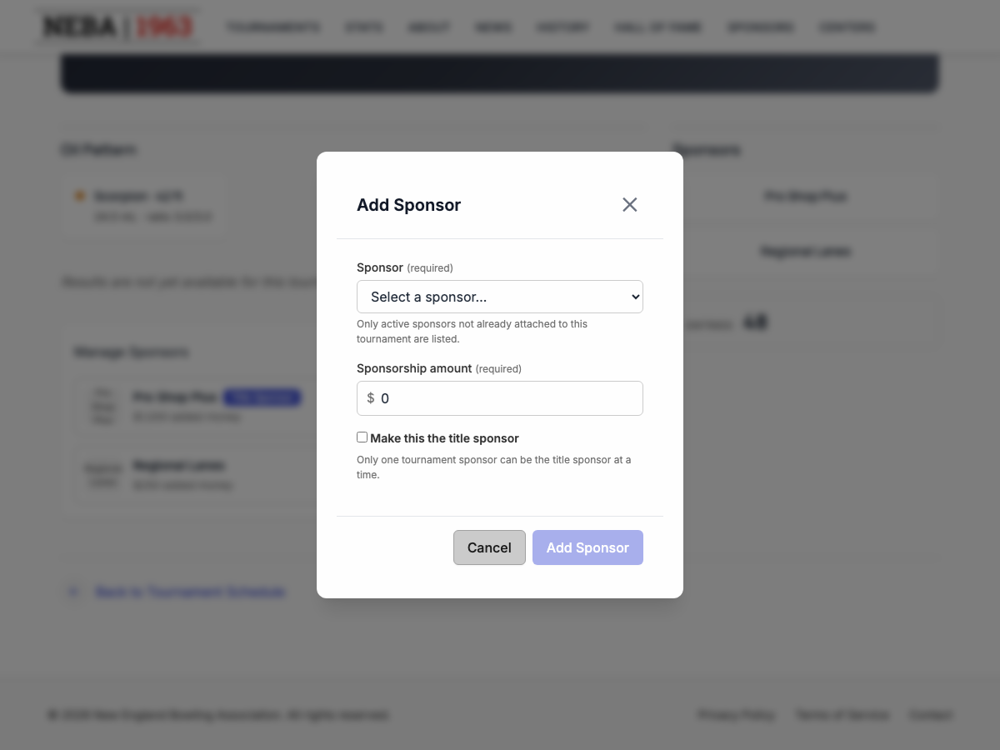
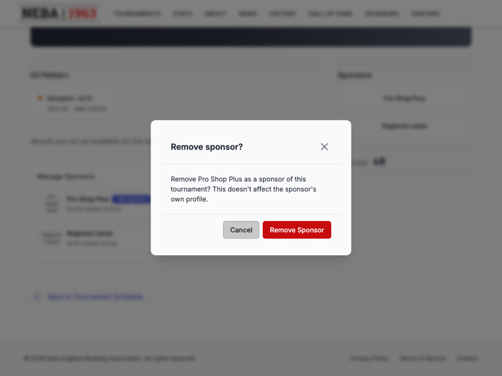

# Manage Tournament Sponsors

Lets tournament management add or remove the sponsors attached to a tournament, including which one (if any) is the title sponsor.

## Prerequisites

You need the `Tournaments.ManageSponsors` permission, enforced via the dynamic `Permission:Tournaments.ManageSponsors` policy — see the `Permission:{value}` row in [`docs/policies/README.md`](../policies/README.md). If you don't have it, the "Manage Sponsors" panel doesn't appear on the tournament detail page at all.

## Steps

### Add a sponsor

1. Go to a tournament's detail page (`/tournaments/{Id}`).
2. In the **Manage Sponsors** panel, click **+ Add Sponsor**.
3. In the dialog, pick a sponsor from the **Sponsor** list (only active sponsors not already attached to this tournament are shown), enter the **Sponsorship amount**, and optionally check **Make this the title sponsor**.
4. Click **Add Sponsor** to save, or **Cancel** to back out. If you've entered anything and try to cancel or close the dialog, you're asked to confirm discarding it.

### Remove a sponsor

1. In the **Manage Sponsors** panel, find the sponsor and click **Remove**.
2. A confirmation dialog titled **"Remove sponsor?"** appears, naming the specific sponsor. Removing only detaches the sponsor from this tournament — it doesn't affect the sponsor's own profile.
3. Click **Remove Sponsor** to confirm, or **Cancel** to back out and leave the sponsor attached.

## What happens after you confirm

- **Adding**: a "Sponsor Added" toast confirms the sponsor was attached, the dialog closes, and the sponsor list refreshes to show it.
- **Removing**: a "Sponsor Removed" toast confirms the sponsor was detached, and it disappears from the list.
- **Failure** (either action): an alert appears in the panel explaining the problem, and the sponsor list is left unchanged.

## Troubleshooting

| What you see | What it means |
| --- | --- |
| No "Manage Sponsors" panel on the tournament detail page | You don't hold `Tournaments.ManageSponsors` — ask an admin to grant it if you believe you should have it. |
| Sponsor doesn't appear in the "Add Sponsor" list | It's either inactive or already attached to this tournament — only active, not-yet-attached sponsors are offered. |
| "Couldn't Add Sponsor" / "Couldn't Update Sponsors" alert | The add or remove request was rejected by the server (e.g. a validation or state problem). No change was made; try again or contact support if it persists. |

## Related

- [`docs/policies/README.md`](../policies/README.md) — the `Permission:{value}` policy this action requires and how it's evaluated.
- [`docs/help/create-tournament.md`](create-tournament.md) — creating the tournament this panel manages sponsors for.
