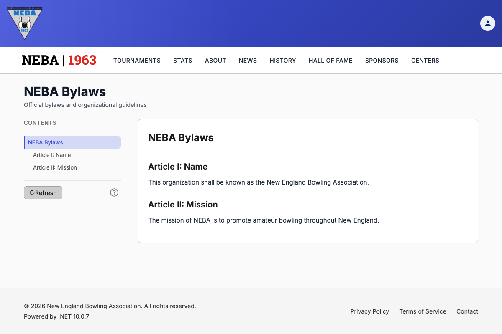

# Refresh a Document

Lets a webmaster force a document page (Bylaws, Tournament Rules) to pull the latest version from Google Drive right away, instead of waiting for the cached copy to expire (up to 7 days).

## Prerequisites

You need the `Documents.RefreshDocument` permission, enforced via the dynamic `Permission:Documents.RefreshDocument` policy — see the `Permission:{value}` row in [`docs/policies/README.md`](../policies/README.md). If you don't have it, no **Refresh** button appears on the document page.

## Steps

1. Edit and save the document in Google Drive.
2. Go to the document's page on the site — **Bylaws** (`/bylaws`) or **Tournament Rules** (`/tournaments/rules`).
3. In the table of contents (the sidebar on a wide screen, or the contents panel on a phone), find the **Refresh** button at the bottom, beside the **Last updated** date when the page shows one. The **?** button next to it opens this help.
4. Click **Refresh**. There's no confirmation step — the action only clears the site's saved copy and can't lose anything.

## What happens after you click

- **Success**: a "Refreshing document..." indicator shows while the site clears its saved copy, then the page reloads and shows the current version from Google Drive. The **Last updated** date changes to today.
- **Failure**: a "Refresh Failed" toast explains the problem, the **Refresh** button turns back on, and the page keeps showing the previous version.

## Troubleshooting

| What you see | What it means |
| --- | --- |
| No **Refresh** button on the page | You don't hold `Documents.RefreshDocument`. Ask an admin to grant it if you believe you should have it. |
| "Refresh Failed" toast | The server rejected the request or couldn't be reached. Most often this means your session expired or you lost the permission (a 401 or 403). Sign in again and retry. |
| Page reloads but still shows the old text | The site fetched Google Drive's current copy, so the change isn't in the Drive document yet. Confirm it saved in Google Drive, then refresh again. |

## Related

- [`docs/policies/README.md`](../policies/README.md) — the `Permission:{value}` policy this action requires and how it's evaluated.
