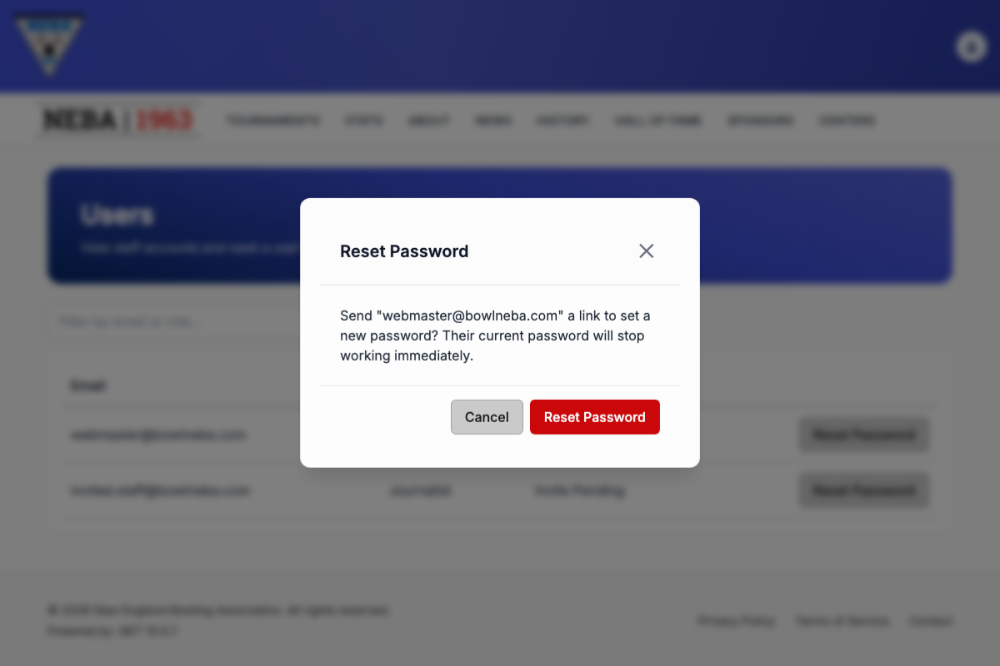

# Reset a User's Password

Lets an admin force a password reset for an existing staff account — the user gets an emailed link and sets a brand-new password themselves. No temporary or admin-visible password is ever generated.

## Prerequisites

You need the `System.ResetUserPassword` permission, enforced via the dynamic `Permission:System.ResetUserPassword` policy — see the `Permission:{value}` row in [`docs/policies/README.md`](../policies/README.md). If you don't have it, the **Reset Password** button doesn't appear next to any row on the [Users](list-users.md) page — you'll still see the list if you separately hold `System.GetUsers`, just without that action.

## Steps

1. Open the [Users](list-users.md) page (account menu → **Users**) and find the account in the table.
2. Click **Reset Password** in that row.

   

3. Confirm — the dialog reads *"Send "\{email}" a link to set a new password? Their current password will stop working immediately."* Click **Reset Password** to send it, or **Cancel** to back out without doing anything.

## What happens after you confirm

- **Success**: a "Password Reset Sent" toast confirms the email was sent (*"A password-set link was emailed to "\{email}"."*).
- **Failure**: a "Reset Password Failed" toast explains what went wrong (see Troubleshooting below) — no email was sent.

This is the same set-password mechanism used for [inviting a new user](create-user.md#setting-the-password-invite-flow): the link opens `/account/set-password` with the user's id and token embedded in the URL, requires no login to use, and is one-time — using it (or letting it expire) invalidates it for further use. The user's existing password stays valid until they actually complete the link — sending the reset alone does not lock them out.

## API

`POST /security/password/reset` with a `{ "userId": "<ulid>" }` body — this is what the button above calls. Direct API access (e.g. via Swagger or a REST client) works the same way if you need to script it.

- **204 No Content** — the reset email was sent.
- **404 Not Found** — no user exists with the given id.
- **422 Unprocessable Entity** — the request body failed validation.

## Troubleshooting

| What you see | What it means |
| --- | --- |
| No "Reset Password" button next to a row | You don't hold `System.ResetUserPassword` — ask an admin to grant it if you believe you should have it. |
| "Reset Password Failed" toast | The server rejected the request; the toast message describes the specific problem (e.g. the account no longer exists). |
| The user says the link doesn't work | Reset links are one-time and expire — if the user waited too long or the link was already used (e.g. requested twice), send a fresh one. |

## Related

- [View Users](list-users.md) — where this action is triggered from.
- [Create a User](create-user.md) — the invite flow shares the same set-password link mechanism.
- [`docs/policies/README.md`](../policies/README.md) — the `Permission:{value}` policy this action requires and how it's evaluated.
