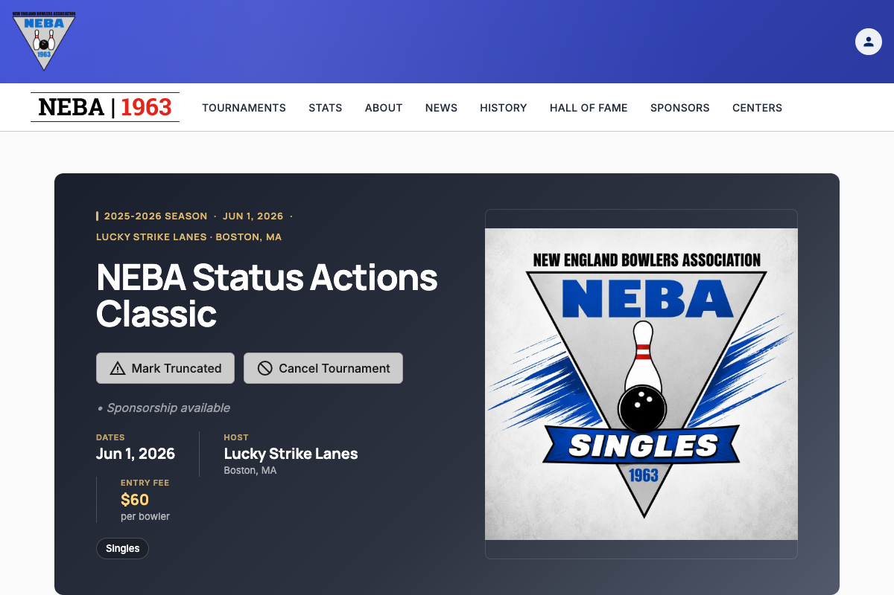
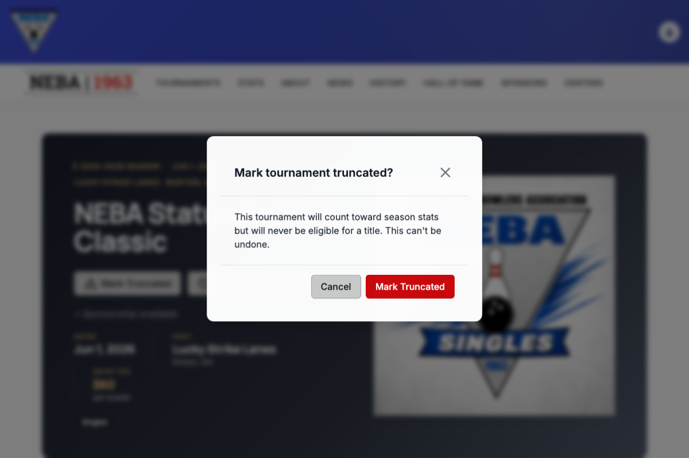

# Mark a Tournament Truncated

Lets a webmaster or admin flag a tournament that was held but didn't finish as planned (for example, finals cancelled for a state of emergency). Results and season stats still count; the tournament just never becomes eligible for a title.

## Prerequisites

You need the `Tournaments.ManageTournamentStatus` permission, enforced via the dynamic `Permission:Tournaments.ManageTournamentStatus` policy — see the `Permission:{value}` row in [`docs/policies/README.md`](../policies/README.md). If you don't have it, no "Mark Truncated" button appears on the tournament page.

The action is only available while the tournament's status is **Scheduled** — once it's Completed, Truncated, or Cancelled, the button disappears and the status can no longer be changed.

## Steps

1. Go to the tournament's detail page (`/tournaments/{id}`).
2. Click **Mark Truncated** near the top of the page.
3. A confirmation dialog titled **"Mark tournament truncated?"** appears, explaining that the tournament will still count toward season stats but will never be eligible for a title. Review it — this step exists because the change is not reversible.
4. Click **Mark Truncated** to confirm, or **Cancel** to back out and leave the tournament untouched.

## What happens after you confirm

- **Success**: a "Tournament Truncated" toast confirms the change, and the page updates in place — a **Truncated** badge appears next to the tournament name, an eligibility note explains that it doesn't count toward a title, and the status action buttons disappear (the change is final).
- **Failure**: a "Truncate Failed" toast explains the problem, and the tournament's status is unchanged.

## Troubleshooting

| What you see | What it means |
| --- | --- |
| No "Mark Truncated" button on the page | Either you don't hold `Tournaments.ManageTournamentStatus` (ask an admin to grant it if you believe you should have it), or the tournament is no longer Scheduled — it's already Completed, Truncated, or Cancelled. |
| "Truncate Failed" toast | The request was rejected by the server. Most commonly this means the tournament was finalized (completed, truncated, or cancelled) by someone else in the moments before your request (a 409 conflict). It can also mean a permission or state problem on the request. The tournament's status was not changed; refresh the page to see its current status. |

## Related

- [`docs/policies/README.md`](../policies/README.md) — the `Permission:{value}` policy this action requires and how it's evaluated.
- [`docs/help/cancel-tournament.md`](cancel-tournament.md) — the equivalent action for a tournament that never ran as a sanctioned NEBA event at all.
- [`docs/help/delete-tournament.md`](delete-tournament.md) — permanently removing a tournament record entirely, a different and unrelated action.
